# Sis Architecture

Sis is a privacy-first DNS gateway for home and small office networks. It runs as a single Go binary that serves DNS over UDP/TCP, exposes an authenticated HTTP API, and embeds a React WebUI for day-to-day operation.

The project is currently in early v1 implementation, but the core runtime is already wired end to end: configuration loading and hot reload, DNS pipeline, policy engine, DoH upstream forwarding, query/audit logging, stats aggregation, file-backed persistence, API handlers, CLI commands, and the embedded WebUI shell are present.

## Current Status

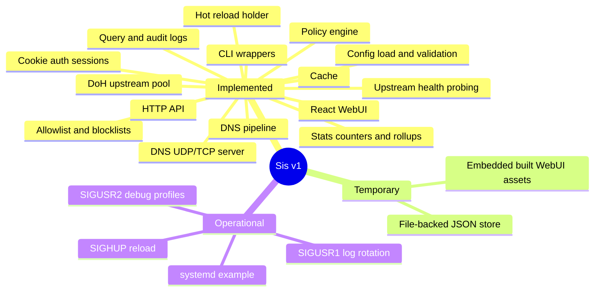

## System Context

Sis sits between LAN clients and upstream DNS-over-HTTPS providers. Users and administrators interact with the same running process through the WebUI, HTTP API, or CLI commands.

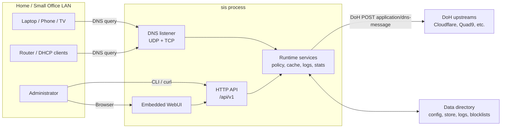

## Runtime Composition

`cmd/sis/main.go` is the composition root. The `serve` command loads configuration, initializes shared dependencies, starts background workers, then starts the DNS and HTTP servers.

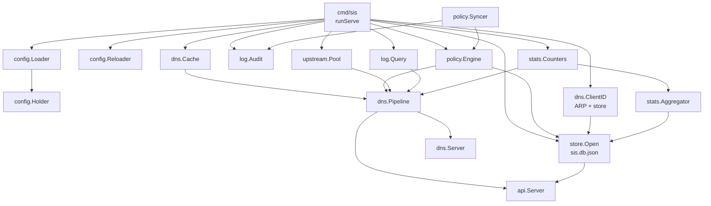

## Package Map

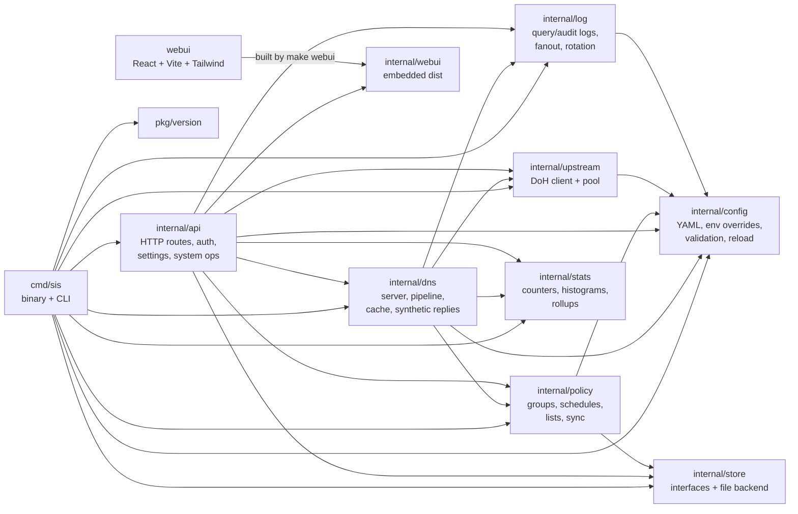

## DNS Query Flow

The DNS server accepts UDP and TCP on each configured listen address. UDP packets are dispatched through a bounded worker pool; TCP connections are capped with a slot semaphore. Both protocols converge on `dns.Pipeline.Handle`.

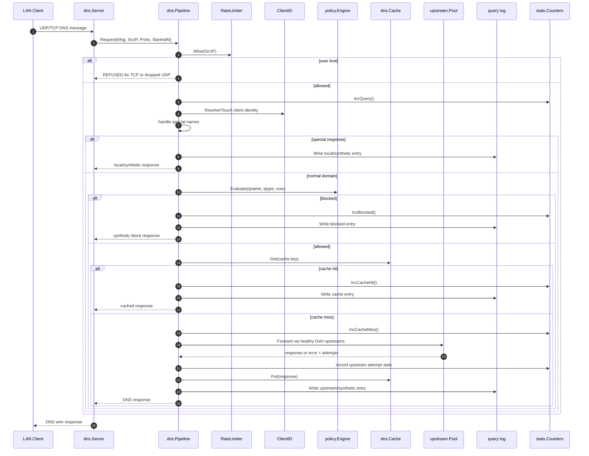

## Pipeline Stages

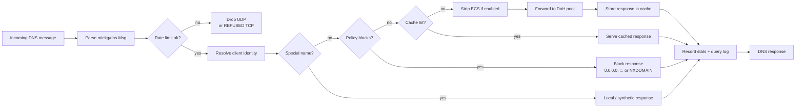

## Policy Model

Policy evaluation is group-oriented. Clients resolve to groups through the store-backed client resolver. A query can be allowed globally, allowed by custom/group allowlist, blocked by a group blocklist, blocked by an active schedule, or blocked by the custom blocklist.

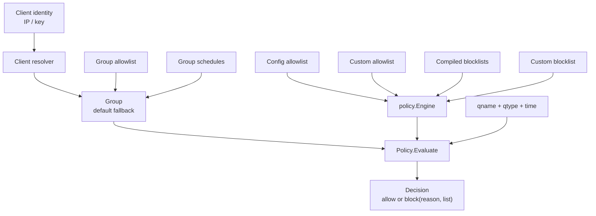

## HTTP API And WebUI

The HTTP server uses Go's `http.ServeMux`. `/healthz`, `/readyz`, setup, and login are public. Most `/api/v1/*` routes require a valid server-side session cookie. The embedded WebUI is served as a fallback route and calls the same API.

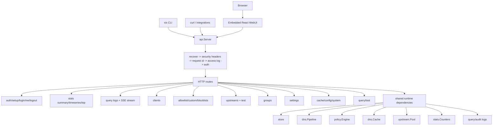

## Persistence Layout

The current store implementation is intentionally simple: a JSON file under the configured data directory. Logs and downloaded blocklists live beside it. The `internal/store` package already exposes interfaces, so the backend can be replaced without changing API, policy, or stats callers.

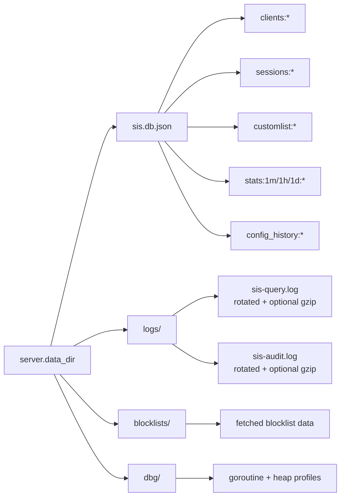

## Configuration And Reload

Configuration is loaded from YAML, enriched with defaults and `SIS_*` environment overrides, validated, and stored in an atomic holder. Runtime mutation endpoints update the config file and append config history snapshots.

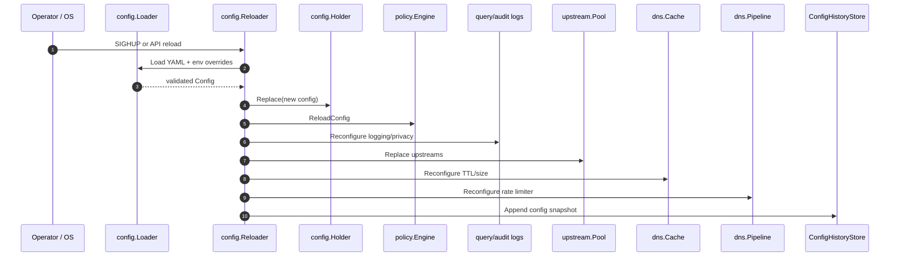

## Background Workers

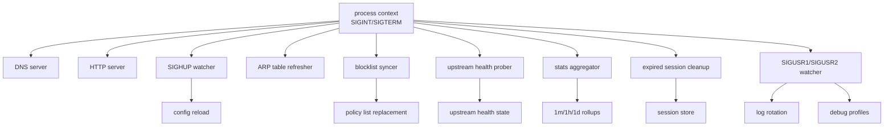

## Build And Delivery

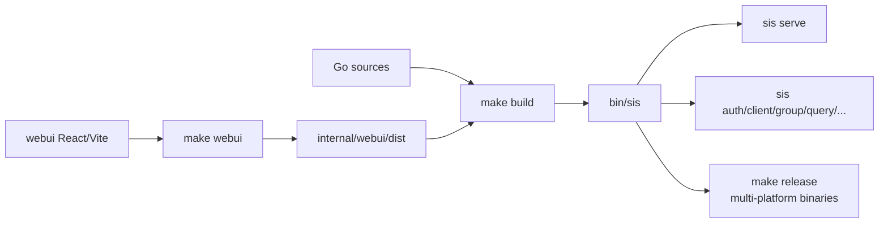

## Main Runtime Dependencies

| Area | Implementation |
| --- | --- |
| DNS protocol | `github.com/miekg/dns` |
| Configuration | YAML via `gopkg.in/yaml.v3`, environment overrides through `SIS_*` |
| HTTP server | Go standard library `net/http` |
| Upstream transport | DNS-over-HTTPS using `application/dns-message` |
| WebUI | React, Vite, Tailwind |
| Persistence | `internal/store` interfaces with current JSON file backend |
| Auth | Server-side sessions stored in `store.SessionStore` |
| Observability | Query/audit logs, live fanout, counters, histograms, persisted rollups |

## API Surface

The API is grouped by runtime concern. CLI commands are thin HTTP clients for many of the same routes, which keeps local automation and the WebUI aligned.

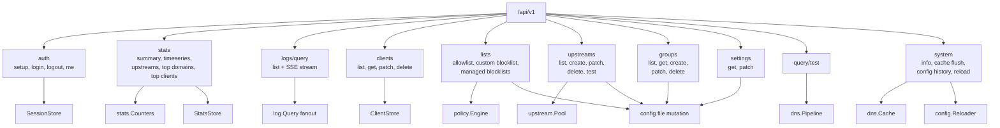

## Authentication Boundary

The public surface is intentionally small. Setup and login create server-side sessions; authenticated requests refresh session expiry with a sliding TTL.

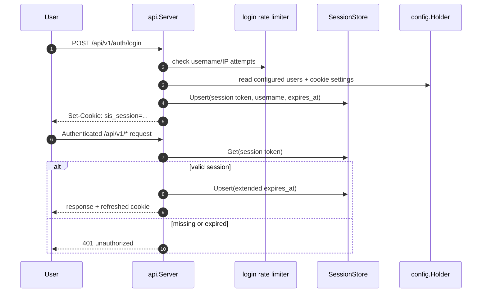

## Data Model

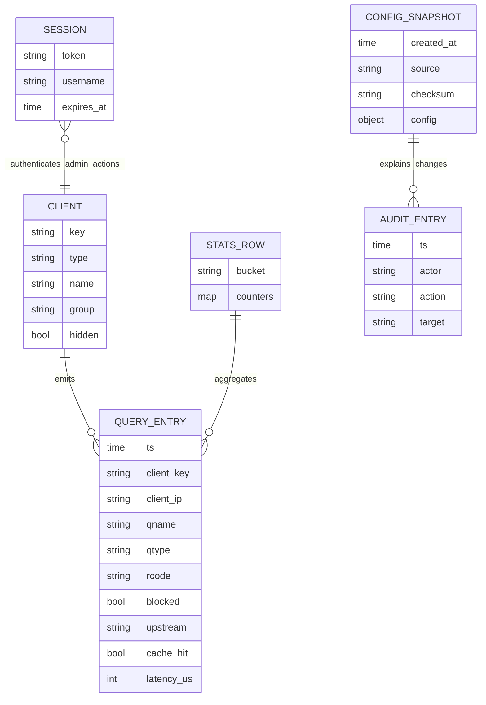

## Configuration Mutation Flow

API endpoints that mutate settings, groups, blocklists, or upstreams edit the YAML configuration rather than only changing memory. This makes the config file the durable source of truth, while reload callbacks update live components.

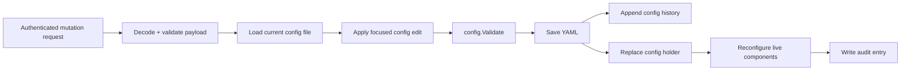

## Observability Flow

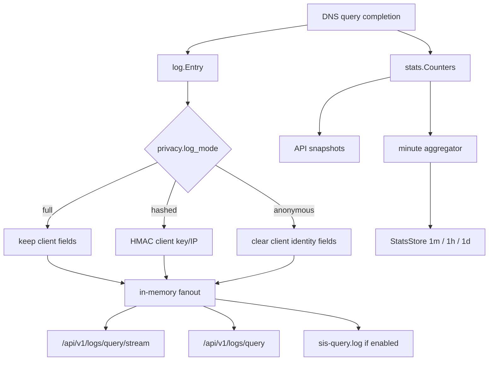

## Development Workflow

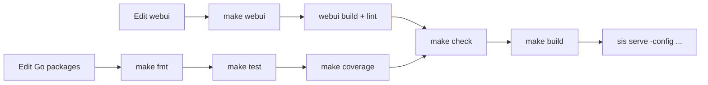

Useful entry points:

| Task | Start here |
| --- | --- |
| DNS behavior | `internal/dns/pipeline.go`, then `internal/dns/server.go` |
| Policy rules | `internal/policy/engine.go`, `internal/policy/group.go`, `internal/policy/domains.go` |
| API behavior | `internal/api/server.go`, then the route-specific file |
| Config shape | `internal/config/types.go`, `internal/config/validate.go`, `internal/config/load.go` |
| Persistence | `internal/store/store.go`, then `internal/store/file.go` |
| WebUI behavior | `webui/src/App.tsx`, `webui/src/lib/api.ts` |
| Runtime wiring | `cmd/sis/main.go` |

## Important Design Properties

- **Single-process runtime:** DNS, API, WebUI, policy, stats, logs, and background workers share memory and lifecycle.
- **Config-centered behavior:** most runtime choices come from `config.Config`; reload callbacks keep long-lived components in sync.
- **Policy before upstream:** allow/block decisions happen before cache misses are forwarded, preventing unwanted external resolution.
- **Privacy controls in the hot path:** ECS stripping happens before upstream forwarding; log privacy modes are applied before fanout and disk writes.
- **Backend isolation:** the store is accessed through interfaces, making the current file-backed persistence replaceable.
- **Operational simplicity:** common deployment only needs a config file, writable data directory, and one static binary.

## Known Architectural Gaps / Next Hardening Areas

- The store backend is a temporary file-backed JSON database; it is suitable for early v1 development but not ideal for high write concurrency or large installations.
- The WebUI source and embedded `internal/webui/dist` must stay synchronized through `make webui`.
- Runtime reload updates many shared components, but DNS listen addresses themselves are established at server start.
- More explicit architecture-level integration tests would help cover full DNS-to-API-to-store behavior across reloads.
- Long-term persistence, backup, and migration strategy should be finalized before a production v1 release.
